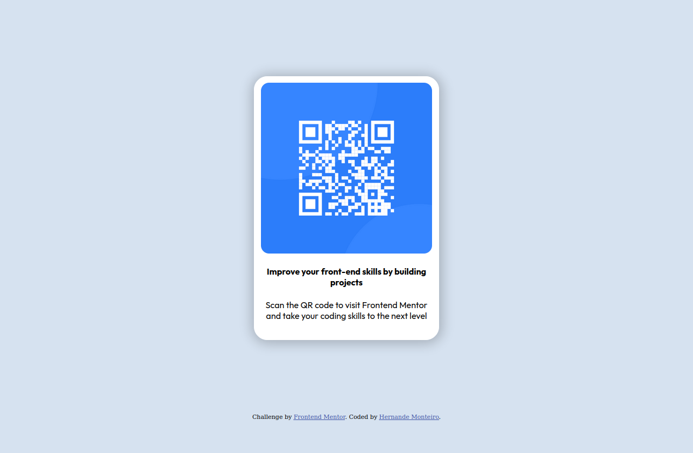

# Frontend Mentor - QR code component solution

This is a solution to the [QR code component challenge on Frontend Mentor](https://www.frontendmentor.io/challenges/qr-code-component-iux_sIO_H). Frontend Mentor challenges help you improve your coding skills by building realistic projects.

## Table of contents

- [Overview](#overview)
  - [Screenshot](#screenshot)
  - [Links](#links)
- [My process](#my-process)
  - [Built with](#built-with)
  - [Useful resources](#useful-resources)
- [Author](#author)

## Overview

### Screenshot

### Links

- Live Site URL: [Add live site URL here](https://hernandemonteiro.github.io/qrcode-mentor/)

## My process

### Built with

- Semantic HTML5 markup
- CSS custom properties
- Flexbox

### Useful resources

- [Shadow Generator](https://cssgenerator.org/box-shadow-css-generator.html) - This helped me create an shadow for the card.

## Author

- Website - [Hernande Monteiro](https://hernandemonteiro.vercel.app)
- Frontend Mentor - [@hernandemonteiro](https://www.frontendmentor.io/profile/hernandemonteiro)
- Twitter - [@monteiro_ops](https://www.twitter.com/monteiro_ops)
